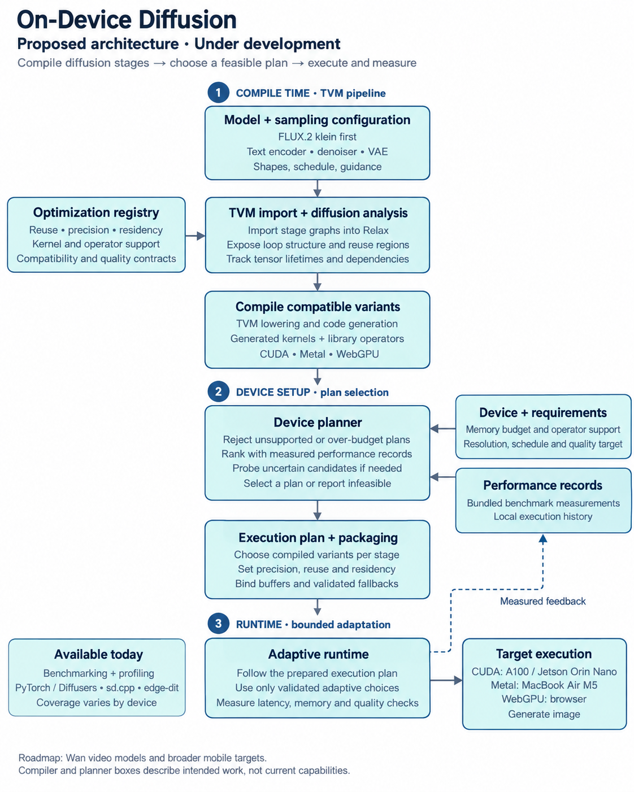

# On-Device Diffusion

Efficient diffusion inference across GPUs, edge devices, and browsers.

[Project overview](wiki/project/overview.md) · [Experiments](wiki/experiments.md) · [Roadmap](wiki/project/milestones.md) · [Contribute](#contributing)

## About

We are researching how to run diffusion models efficiently under limited memory and compute.
The goal is a diffusion-aware compiler and runtime planner that jointly chooses **computation
reuse, precision, and memory placement** to reduce latency while meeting a declared quality requirement.

**This project is under active development.** The repository currently provides benchmarking,
profiling, and experiment records. The compiled pipeline and planner are being developed;
they are not yet a ready-to-use inference engine.

## Proposed architecture

The diagram shows the intended design. Today's benchmarking and profiling work supplies evidence
for the compiler and planner; Wan and broader mobile support remain future work.

## Current focus

| Area | Status |
|---|---|
| FLUX.2 klein, distilled and Base | A100 and Jetson Orin Nano benchmarks and profiling |
| Existing engines | PyTorch + Diffusers, stable-diffusion.cpp, and edge-dit.cpp comparisons; coverage varies by device |
| Compilation and planning | Planned TVM pipeline targeting CUDA, Metal, and WebGPU |
| Broader workloads and devices | Wan video models and mobile targets are future work |

Experiments cover stage timing, memory use, caching, and weight loading. See the
[experiment registry](wiki/experiments.md) for configurations, results, failures, and comparison limits.

## Explore the repository

- [Runners and profiling tools](scripts/README.md) — how the measurements are collected.
- [Configurations](configs/) and [results](results/README.md) — labelled experiments and saved measurements.
- [Research wiki](wiki/index.md) — findings, methods, design decisions, and open questions.

## Contributing

This is a good time to contribute: profiling evidence and feedback can help shape the system.
We especially welcome **FLUX or Wan measurements on edge devices**, including Jetson, Apple silicon,
mobile hardware, and other GPU targets, as well as A100 reference results.

[Open an issue](https://github.com/mfaruqi/on-device-diffusion/issues) to share results, traces, an
optimization experiment, or a reproducibility problem. Useful reports include:

- Hardware and software versions, engine, model/checkpoint, and execution settings.
- Timing and memory measurements, separating first-run, warm-up, and measured generations.
- Quality observations and any failures or limitations, especially when using quantization or caching.

Small, reproducible contributions are welcome. Keep model weights and large traces outside Git;
link to artifacts and include the configuration needed to reproduce them.

---

Research by Mahad Faruqi at Purdue EcoAI Lab, advised by Prof. Haoran You.
